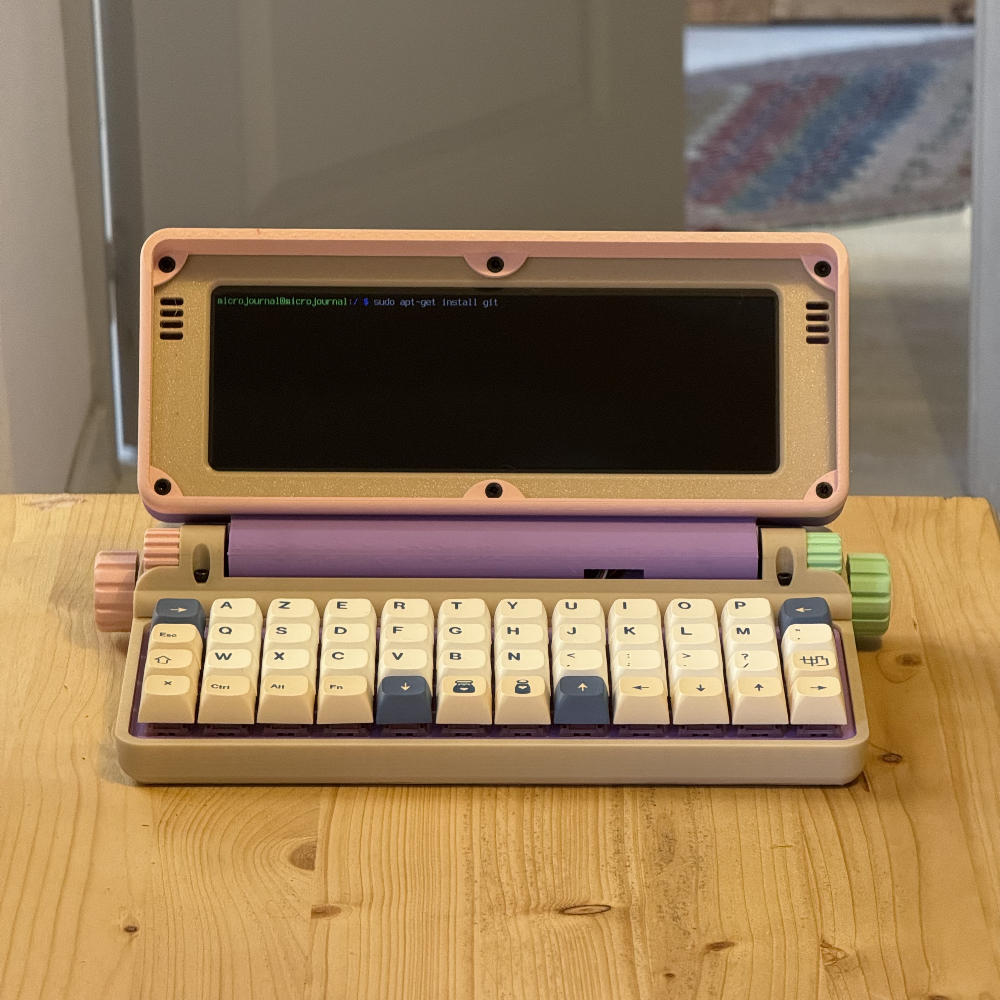

# **1. Découvrir le MicroJournal**

## Qu’est-ce que le MicroJournal ?

Le [Micro Journal Rev.2.ReVamp](https://github.com/unkyulee/micro-journal/blob/main/micro-journal-rev-2-revamp/readme.md) est un petit ordinateur portable minimaliste, conçu pour favoriser l’écriture **sans distraction**. Contrairement aux tablettes ou aux ordinateurs classiques, il ne propose pas d’applications variées ni de navigation sur Internet. Son objectif principal est d’offrir un espace dédié à l’écriture et à la **concentration**, tout en étant compact et transportable.

Cet appareil repose sur un **Raspberry Pi** Zero 2 W et fonctionne sous **Linux** (Raspbian). Il se distingue par son interface simplifiée et ses outils minimalistes, permettant une expérience pure d’écriture, inspirée des machines à écrire modernes. 

## Pourquoi cet appareil a-t-il été conçu ?

L’idée du MicroJournal est née d’un besoin grandissant d’éliminer les distractions numériques. Aujourd’hui, les smartphones et ordinateurs sont saturés de notifications, de publicités et de réseaux sociaux qui captent notre attention. Le Micro Journal propose une alternative radicale : un outil dédié à l’**écriture**, sans fioritures ni interruptions.

Son créateur, *Un Kyu Lee*, voulait offrir aux auteurs, étudiants et penseurs un moyen simple d’écrire partout et en toute sérénité. C’est un retour à l’essentiel, avec un outil qui ne fait qu’une chose, mais qui le fait bien. 

## Son design et ses matériaux

Le MicroJournal a un design unique. 

Les matériaux utilisés sont à la fois robustes et légers, avec un châssis en plastique résistant. Il est fabriqué dans l'atelier du designer, Un Kyu Lee, en Italie, avec une imprimante 3D. Son créateur a publié les plans de fabrication, pour que n'importe qui le souhaite puisse fabriquer un Micro Journal. Il est aussi possible de refabriquer une pièce si elle est cassée. D'autres personnes passionnées peuvent également proposer des versions modifiées selon leur goût, à partir des plans. 

L'appareil est compact et se replie sur lui-même, protégeant ainsi son écran et son clavier lors du transport. 

Les charnières de l'écran possèdent une fonction secrète : elles sont aussi des molettes qui permettent de faire défiler le texte. On en reparlera dans le chapitre suivant. 

L’écran est assez petit, mais large et rétro-éclairée. Il ne s’agit pas d’un écran tactile, ce qui renforce l’expérience minimaliste de l’appareil.

Il y a une batterie à l'intérieur. Pour la recharger, on utilise simplement un chargeur avec un câble USB-C que l'on branche derrière. On peut utiliser Le Micro Journal avec le chargeur branché si on a plus assez de batterie. Toujours derrière, un bouton permet de voir le pourcentage de la charge de la batterie. 

## Le clavier et les molettes : une interface minimaliste

Le MicroJournal ne possède pas de clavier classique. Il est doté d’un clavier rectangulaire de 48 touches : 4 lignes de 12 touches.

Ce sont des vraies grosses touches qui permet une frappe comfortable tout en restant compact. Le designer a fait sa configuration de touche mais il nous incite à trouver la meilleure configuration des touches. 

J'ai donc configuré le clavier en **Azerty** (les américains utilisent la configuration Qwerty) avec une variante Macintosh que je trouve plus adaptée à l'écriture du français – en particulier sur le Micro Journal qui a moins de touche. 

Nous en avions déjà parlé, deux **molettes** situées sur le côté permettent de naviguer dans les textes et d’interagir avec l’interface, en remplacement d’une souris ou d’un pavé tactile. La molette de gauche (rose) permet de naviguer horizontalement. Celle de droite (verte) permet de naviguer verticalement. 

## Démarrage…

Démarrons l'appareil, avec le bouton ON / OFF à l'arrière… L’appareil démarre rapidement, des messages bizarres défilent à l'écran… mais on accède rapidement à un environnement textuel épuré, c'est « `ranger` ». Pas d’icônes inutiles, pas de notifications envahissantes, juste un espace prêt à accueillir tes idées.

La prise en main du clavier demande un petit temps d’apprentissage. Mais tu verras, on s’habitue vite. 

Le MicroJournal sera un compagnon d’écriture fidèle et fiable, idéal pour se concentrer sur l’essentiel : l'**écriture**.