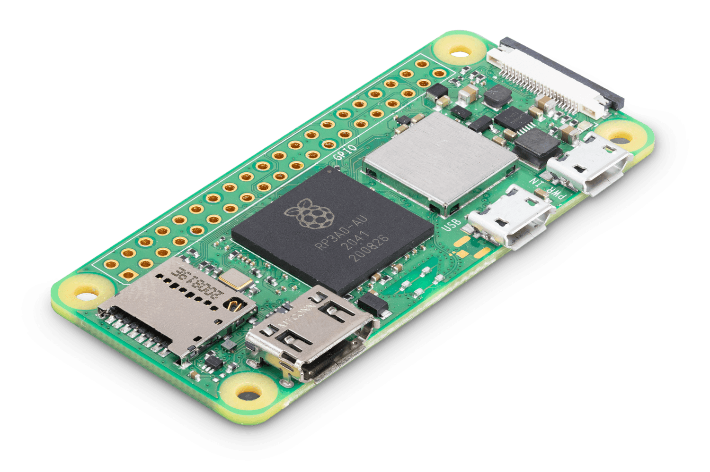

# **2. À l’intérieur de la machine : le Raspberry Pi**

## C’est quoi un Raspberry Pi ?

Le Raspberry Pi, c’est un tout petit ordinateur, à peine plus grand qu’une carte de crédit ! Il est conçu pour être simple, pas cher et accessible à tout le monde. On peut s’en servir pour apprendre à programmer, contrôler des robots, créer des objets électroniques ou, comme dans le MicroJournal, avoir un ordinateur minimaliste pour écrire.

Le Raspberry Pi ne ressemble pas aux ordinateurs qu’on trouve dans les magasins. Il n’a pas d’écran, pas de clavier, et il faut y brancher des accessoires pour l’utiliser. Mais c’est justement ce qui fait son charme : il est personnalisable et peut être utilisé pour plein de projets différents !

J'ai moi même branché 20 raspberry pi pour faire un projet de photomaton !

## Les différentes versions et pourquoi celui-ci a été choisi

Depuis sa création en 2012, plusieurs modèles de Raspberry Pi ont vu le jour. Certains sont très puissants et peuvent presque remplacer un ordinateur classique, d’autres sont plus petits et plus économes en énergie.

Le MicroJournal utilise un **[Raspberry Pi Zero 2 W](https://www.raspberrypi.com/products/raspberry-pi-zero-2-w/)**. Pourquoi ce choix ? Parce que ce modèle est :

- **Petit et léger** : parfait pour un appareil portable comme le MicroJournal, il mesure 65mm x 30mm.
- **Peu gourmand en énergie** : il peut fonctionner longtemps sans trop chauffer, et sur une petite batterie.
- **Assez puissant pour écrire** : pas besoin d’un super ordinateur pour taper du texte !

Ce Raspberry Pi est donc l’idéal pour un appareil qui doit être simple, compact et efficace pour l’écriture.

## Des utilisations étonnantes du Raspberry Pi

Le Raspberry Pi est utilisé dans le monde entier pour des projets incroyables. Voici quelques exemples amusants et inspirants :

- **Console de jeux** : Avec un Raspberry Pi, on peut recréer une vieille console et jouer à des jeux vidéo des années 80 et 90, comme ceux de l'époque de tes parents.
- **Robot programmeur** : Des écoles l’utilisent pour apprendre aux enfants à construire et programmer des petits robots.
- **Détecteur de chats** : Certains bricoleurs ont programmé leur Raspberry Pi pour reconnaître les chats et leur ouvrir la porte !
- **AstroPi Dans l'ISS : Mission Zero** : Oui, un ordinateur Astro Pi est à bord de la **Station spatiale internationale**, et des jeunes élèves participent à un concours pour le piloter depuis la terre !

Le Raspberry Pi, c’est donc une petite machine électronique, qui peut faire plein de choses, et ici, il fait du Micro Journal un compagnon d’écriture magnifique !