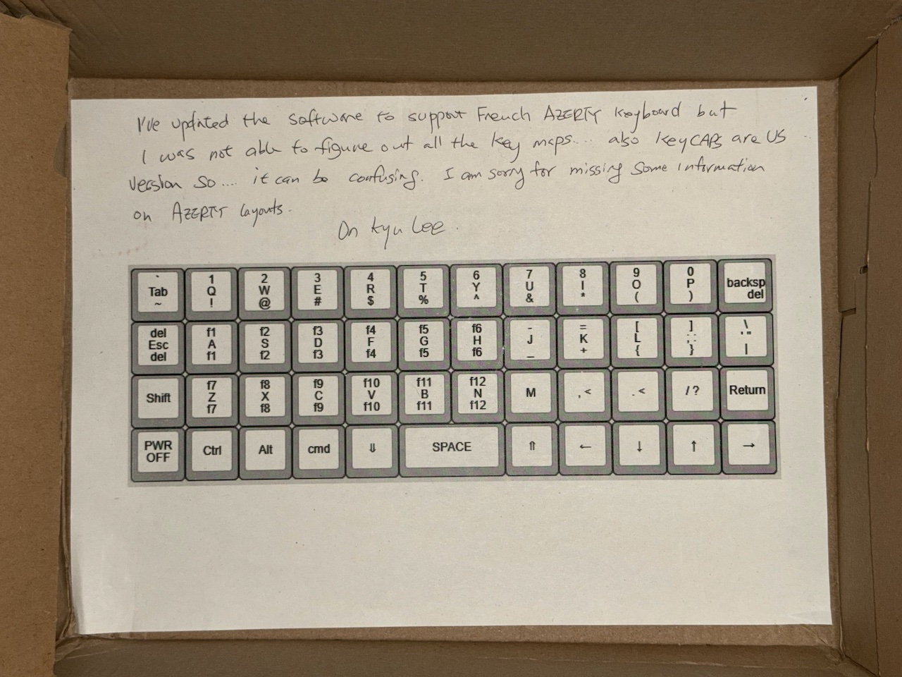
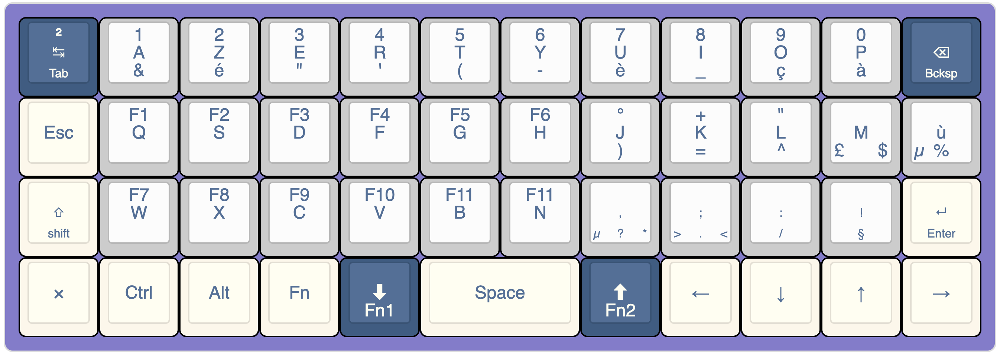
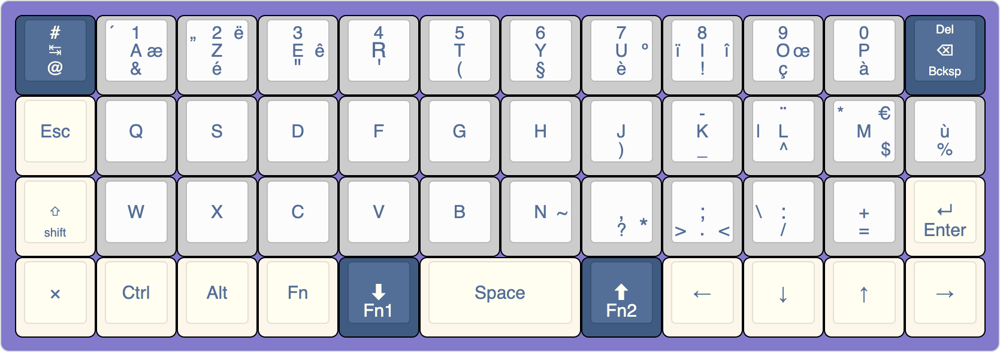
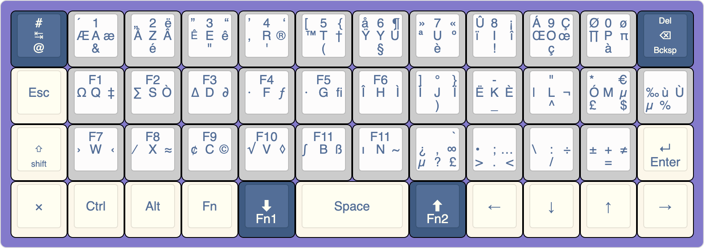

# Clavier(s) français Azerty

Un Kyu Lee avait déposé le message suivant au fond de son colis : 

> I've updated the software to support french AZERTY keyboard but I was not able to figure out all the key maps... also keycaps are US version so... it can be confusing. I am sorry for missing some information on AZERTY Layouts.
> — Un Kyu Lee

Merci à lui pour ce premier effort. 



Au delà des « *keycaps* » – les *capuchons de touche* qui ne correspondent pas visuellement, ce layout mérite à mon sens des améliorations. Je suis pour ma part habitué au clavier Mac, et je pense qu'il serait plus adapté également pour un Azerty. Avant cela, j'ai voulu documenté l'état initial du MJ, tel que je l'ai reçu, fin février 2025. 

## Layout Azerty Français ISO par défaut

Voici donc le clavier, que j'ai essayé de le décrire, tel que configuré par le constructeur :



Capture d'écran de [keyboard-layout-editor.com](https://www.keyboard-layout-editor.com/##@_backcolor=%23837acb&css=.keylabel%7B%0A%20%20%20%20font-weight%2F:normal%2F%3B%0A%7D%3B&@_c=%233f5b82&t=%23fcf7ea&a:5&fa@:0&:1&:0&:0&:0&:0&:1%3B%3B&=%C2%B2%0ATab%0A%0A%0A%0A%0A%E2%86%B9&_c=%23cccccc&t=%233f5b82&f:3%3B&=1%0A%2F&%0A%0A%0A%0A%0AA&_f:3%3B&=2%0A%C3%A9%0A%0A%0A%0A%0AZ&_f:3%3B&=3%0A%22%0A%0A%0A%0A%0AE&_f:3%3B&=4%0A'%0A%0A%0A%0A%0AR&_f:3%3B&=5%0A(%0A%0A%0A%0A%0AT&_f:3%3B&=6%0A-%0A%0A%0A%0A%0AY&_f:3%3B&=7%0A%C3%A8%0A%0A%0A%0A%0AU&_f:3%3B&=8%0A%2F_%0A%0A%0A%0A%0AI&_f:3%3B&=9%0A%C3%A7%0A%0A%0A%0A%0AO&_f:3%3B&=0%0A%C3%A0%0A%0A%0A%0A%0AP&_c=%233f5b82&t=%23fcf7ea&fa@:0&:1&:0&:0&:0&:0&:2%3B%3B&=%0ABcksp%0A%0A%0A%0A%0A%E2%8C%AB%3B&@_c=%23fcf7ea&t=%233f5b82&a:7%3B&=Esc&_c=%23cccccc&a:5&f:3%3B&=F1%0A%0A%0A%0A%0A%0AQ&_f:3%3B&=F2%0A%0A%0A%0A%0A%0AS&_f:3%3B&=F3%0A%0A%0A%0A%0A%0AD&_f:3%3B&=F4%0A%0A%0A%0A%0A%0AF&_f:3%3B&=F5%0A%0A%0A%0A%0A%0AG&_f:3%3B&=F6%0A%0A%0A%0A%0A%0AH&_f:3%3B&=%C2%B0%0A)%0A%0A%0A%0A%0AJ&_f:3%3B&=+%0A%2F=%0A%0A%0A%0A%0AK&_f:3%3B&=%22%0A%5E%0A%0A%0A%0A%0AL&_a:4&f:3%3B&=%0A%C2%A3%0A%0A$%0A%0A%0A%0A%0A%0AM&_f:3%3B&=%0A%C2%B5%0A%0A%0A%0A%0A%0A%0A%0A%C3%B9%0A%25%3B&@_c=%23fcf7ea&a:5&fa@:0&:1&:0&:0&:0&:0&:1%3B%3B&=%0Ashift%0A%0A%0A%0A%0A%E2%87%A7&_c=%23cccccc&f:3%3B&=F7%0A%0A%0A%0A%0A%0AW&_f:3%3B&=F8%0A%0A%0A%0A%0A%0AX&_f:3%3B&=F9%0A%0A%0A%0A%0A%0AC&_f:3%3B&=F10%0A%0A%0A%0A%0A%0AV&_f:3%3B&=F11%0A%0A%0A%0A%0A%0AB&_f:3%3B&=F11%0A%0A%0A%0A%0A%0AN&_a:4&fa@:0&:1&:0&:1&:0&:0&:1&:0&:0&:1&:1%3B%3B&=%0A%C2%B5%0A%0A*%0A%0A%0A%0A%0A%0A,%0A%3F&=%0A%3E%0A%0A%3C%0A%0A%0A%0A%0A%0A%2F%3B%0A.&_a:5%3B&=%0A%2F%2F%0A%0A%0A%0A%0A%2F:&=%0A%C2%A7%0A%0A%0A%0A%0A!&_c=%23fcf7ea%3B&=%0AEnter%0A%0A%0A%0A%0A%E2%86%B5%3B&@_a:7%3B&=%C3%97&=Ctrl&=Alt&=Fn&_c=%233f5b82&t=%23fcf7ea&a:5&f:3%3B&=%0AFn1%0A%0A%0A%0A%0A%E2%AC%87%EF%B8%8E&_c=%23fcf7ea&t=%233f5b82&a:7&w:2%3B&=Space&_c=%233f5b82&t=%23fcf7ea&a:5&f:3%3B&=%0AFn2%0A%0A%0A%0A%0A%E2%AC%86%EF%B8%8E&_c=%23fcf7ea&t=%233f5b82&a:7%3B&=%E2%86%90&=%E2%86%93&=%E2%86%91&=%E2%86%92)

## Principales critiques

- Des caractères importants, pour l'écosystème Unix, sont manquants : 
  - `@` Arobase
  - `#`  Dièze 
  - `|` Barre verticale
  - `\` Anti Slash
  - `~` Tilde
  - `[]` Crochets et `{}` Accolades
- De nombreuses capitales accentuées, importante en français, ne peuvent être obtenues : 
  - É, È
  - À
  - Î
  - Ç
- Des signes typographiques français sont inaccessibles
  - `« »` Guillemets français
  - `…` Trois petits points
  - `—` tirets quadratins (et demi quadratins)
  - `€` Euros

## Bascule sur un layout Mac

Depuis `sudo raspi-config` il est possible de choisir son layout, j'ai basculé sur cette configuration

```
System Locale: LANG=fr_FR.UTF-8
    VC Keymap: (unset)
   X11 Layout: fr
    X11 Model: pc105
  X11 Variant: mac
```

Je ne suis pas encore satisfait, car je n'arrive pas à réaliser les touches spéciales (capitales accentuées, etc…) mais j'ai accès à déjà plus de confort et des caractères comme le `@` et `#`… à suivre

### Clavier Mac

[J’ai finalement configuré un layout Mac](https://www.keyboard-layout-editor.com/##@_backcolor=%23837acb&css=.keylabel%7B%0A%20%20%20%20font-weight%2F:normal%2F%3B%0A%7D%3B&@_c=%233f5b82&t=%23fcf7ea&a:5&fa@:0&:0&:0&:0&:0&:0&:1%3B%3B&=%23%0A%2F@%0A%0A%0A%0A%0A%E2%86%B9&_c=%23cccccc&t=%233f5b82&a:4&f:3%3B&=%C2%B4%0A%0A%EF%A3%BF%0A%0A%0A%0A%C3%86%0A%C3%A6%0A1%0AA%0A%2F&&_f:3%3B&=%E2%80%9E%0A%0A%C3%AB%0A%0A%0A%0A%C3%85%0A%C3%82%0A2%0AZ%0A%C3%A9&_fa@:0&:0&:0&:0&:0&:0&:2%3B%3B&=%E2%80%9D%0A%0A%E2%80%9C%0A%0A%0A%0A%C3%8A%0A%C3%AA%0A3%0AE%0A%22&_f:3%3B&=%E2%80%99%0A%0A%E2%80%98%0A%0A%0A%0A%E2%80%9A%0A%C2%AE%0A4%0AR%0A'&_f:3%3B&=%5B%0A%0A%7B%0A%0A%0A%0A%E2%84%A2%0A%E2%80%A0%0A5%0AT%0A(&_f:3%3B&=%C3%A5%0A%0A%C2%B6%0A%0A%0A%0A%C5%B8%0A%C3%9A%0A6%0AY%0A-&_f:3%3B&=%C2%BB%0A%0A%C2%AB%0A%0A%0A%0A%C2%AA%0A%C2%BA%0A7%0AU%0A%C3%A8&_f:3%3B&=%C3%9B%0A%0A%C2%A1%0A%0A%0A%0A%C3%AF%0A%C3%AE%0A8%0AI%0A%2F_&_f:3%3B&=%C3%81%0A%0A%C3%87%0A%0A%0A%0A%C5%92%0A%C5%93%0A9%0AO%0A%C3%A7&_f:3%3B&=%C3%98%0A%0A%C3%B8%0A%0A%0A%0A%E2%88%8F%0A%CF%80%0A0%0AP%0A%C3%A0&_c=%233f5b82&t=%23fcf7ea&a:5&fa@:0&:1&:0&:0&:0&:0&:2%3B%3B&=%0ABcksp%0A%0A%0A%0A%0A%E2%8C%AB%3B&@_c=%23fcf7ea&t=%233f5b82&a:7%3B&=Esc&_c=%23cccccc&a:4&f:3%3B&=%0A%0A%0A%0A%0A%0A%CE%A9%0A%E2%80%A1%0AF1%0AQ&_f:3%3B&=%0A%0A%0A%0A%0A%0A%E2%88%91%0A%C3%92%0AF2%0AS&_f:3%3B&=%0A%0A%0A%0A%0A%0A%E2%88%86%0A%E2%88%82%0AF3%0AD&_f:3%3B&=%0A%0A%0A%0A%0A%0A%C2%B7%0A%C6%92%0AF4%0AF&_f:3%3B&=%0A%0A%0A%0A%0A%0A%C2%B7%0A%EF%AC%81%0AF5%0AG&_f:3%3B&=%0A%0A%0A%0A%0A%0A%C3%8E%0A%C3%8C%0AF6%0AH&_f:3%3B&=%0A%0A%0A%0A%0A%0A%C3%8D%0A%C3%8F%0A%C2%B0%0AJ%0A)&_f:3%3B&=%0A%0A%0A%0A%0A%0A%C3%8B%0A%C3%88%0A-%0AK%0A%2F_&_f:3%3B&=%0A%0A%0A%0A%0A%0A%7C%0A%C2%AC%0A%22%0AL%0A%5E&_f:3%3B&=%0A%C2%A3%0A%0A$%0A%0A%0A%C3%93%0A%C2%B5%0A%0AM&_f:3%3B&=%0A%C2%B5%0A%0A%0A%0A%0A%E2%80%B0%0A%C3%99%0A%0A%C3%B9%0A%25%3B&@_c=%23fcf7ea&a:5&fa@:0&:1&:0&:0&:0&:0&:1%3B%3B&=%0Ashift%0A%0A%0A%0A%0A%E2%87%A7&_c=%23cccccc&a:4&f:3%3B&=%0A%0A%0A%0A%0A%0A%E2%80%BA%0A%E2%80%B9%0AF7%0AW&_f:3%3B&=%0A%0A%0A%0A%0A%0A%E2%81%84%0A%E2%89%88%0AF8%0AX&_f:3%3B&=%0A%0A%0A%0A%0A%0A%C2%A2%0A%C2%A9%0AF9%0AC&_f:3%3B&=%0A%0A%0A%0A%0A%0A%E2%88%9A%0A%E2%97%8A%0AF10%0AV&_f:3%3B&=%0A%0A%0A%0A%0A%0A%E2%88%AB%0A%C3%9F%0AF11%0AB&_f:3%3B&=%0A%0A%0A%0A%0A%0A%C4%B1%0A~%0AF11%0AN&_f2:0%3B&=%0A%C2%B5%0A%0A*%0A%0A%0A%C2%BF%0A%E2%88%9E%0A%0A,%0A%3F&=%0A%3E%0A%0A%3C%0A%0A%0A%E2%80%A2%0A%E2%80%A6%0A%0A%2F%3B%0A.&=%0A%0A%0A%0A%0A%0A%5C%0A%C3%B7%0A%0A%2F:%0A%2F%2F&=%0A%0A%0A%0A%0A%0A%C2%B1%0A%E2%89%A0%0A%0A+%0A%2F=&_c=%23fcf7ea&a:5&fa@:0&:1&:0&:0&:0&:0&:1%3B%3B&=%0AEnter%0A%0A%0A%0A%0A%E2%86%B5%3B&@_a:7%3B&=%C3%97&=Ctrl&=Alt&=Fn&_c=%233f5b82&t=%23fcf7ea&a:5&f:3%3B&=%0AFn1%0A%0A%0A%0A%0A%E2%AC%87%EF%B8%8E&_c=%23fcf7ea&t=%233f5b82&a:7&w:2%3B&=Space&_c=%233f5b82&t=%23fcf7ea&a:5&f:3%3B&=%0AFn2%0A%0A%0A%0A%0A%E2%AC%86%EF%B8%8E&_c=%23fcf7ea&t=%233f5b82&a:7%3B&=%E2%86%90&=%E2%86%93&=%E2%86%91&=%E2%86%92)
car il me semble plus adapté à l'écriture en français, avec des caractères accentués et des signes typographiques français.
Et beaucoup de capitales et ligatures accentuées que je trouve logiques.



